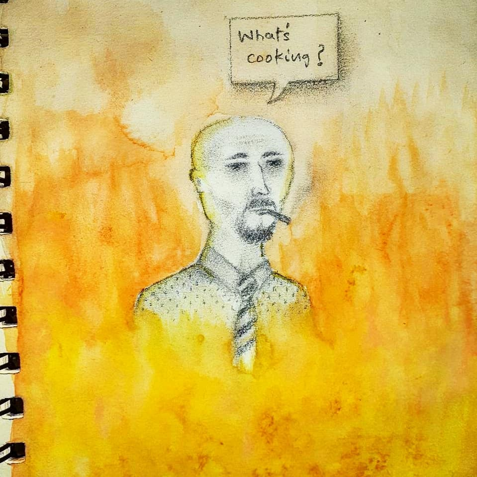
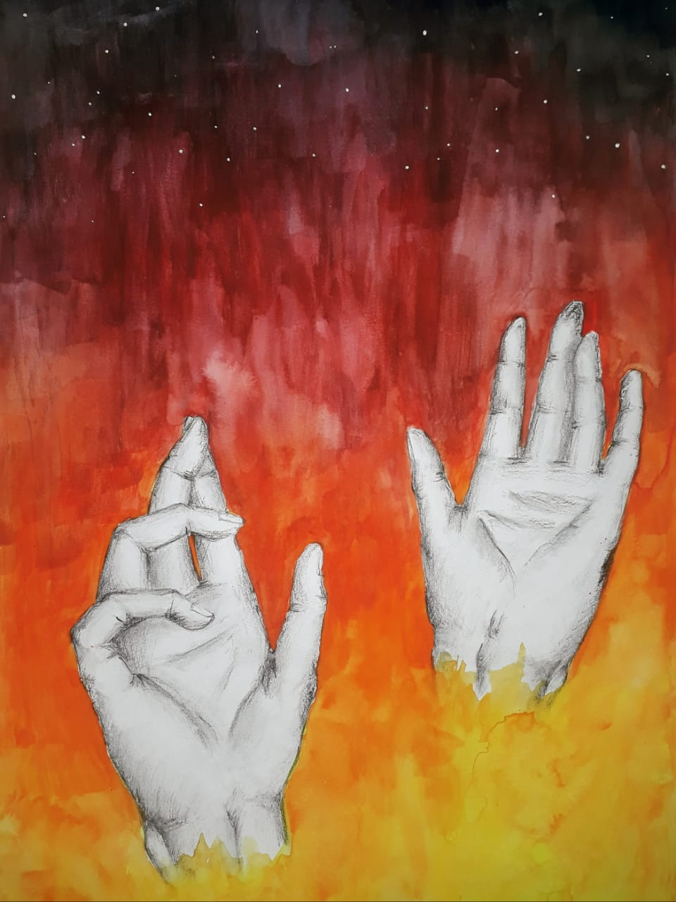
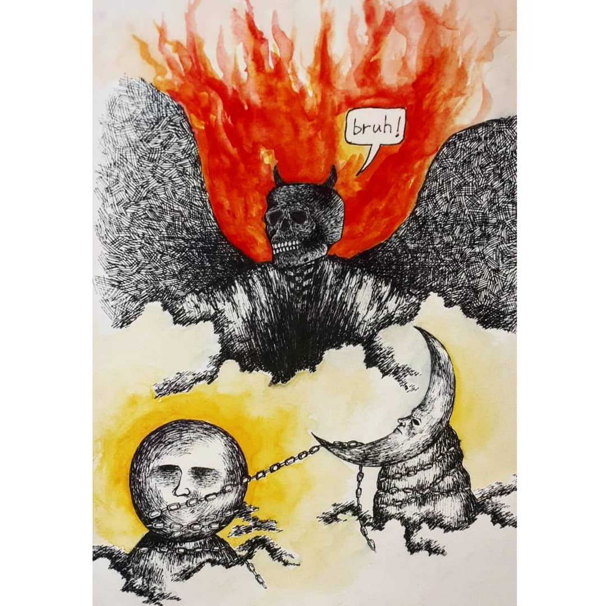
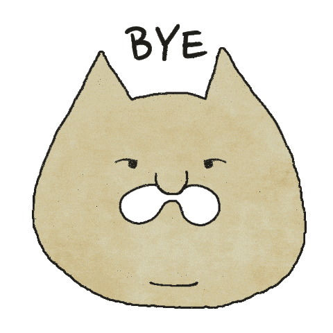

                                                                                                            
 

I'm *Nabeel Farooqui*, probably the first time you ever heard this name and I hope you pronounced it well. 

Skipping the rest, ✨ _Art_ ✨ is my passion, I like to sketch or paint whatever idea comes into my mind. Sometimes I write, although not very good at it. I like designing and making stuff too. I'll drop some of my artworks down below for you to check 'em out -->

-
The bald guy is not conscious enough to realise that he himself is being cooked.
-
The idea of this one is that a person is being engulfed by his negative thoughts. The starts represent night time, usually when these thoughts occur. 
-
The devil has been shown burning in flames, the sun and the moon are shown below tied together with a chain.
-
- :)
-If you wanna follow my [instagram page](https://www.instagram.com/thy_is_art/) :)  

Music is one of my hobbies, I enjoy singing, some of the music instruments that I find interesting are - Guitar, Drums and Bass. I kinda listen to all kinds of music but i hate kpop, and I hope you do too. Some of my favourite genres are - RnB and Soul, Metal, Progressive Metal, Rap, Post Rock, Hip Hop and Folk. I like anime too, always end up binge watching.

Guess that's enough, thanks for going through it!

 

